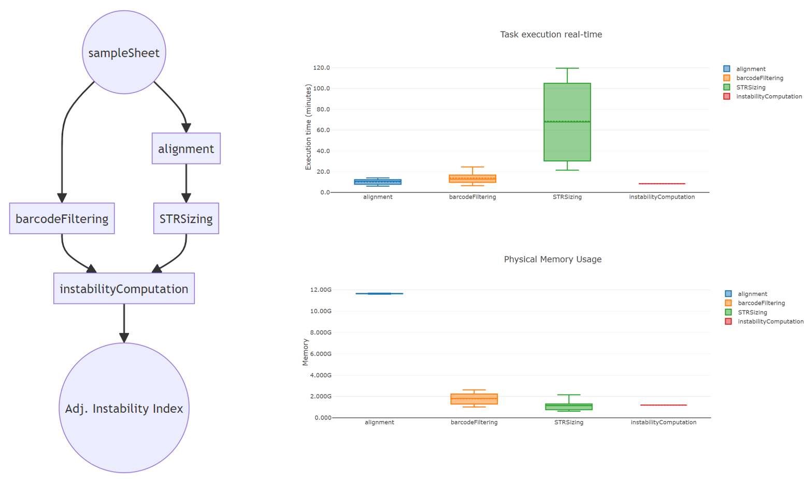

# T-Rex

**T-Rex** is a [Nextflow](https://www.nextflow.io) pipeline for evaluating somatic instability of CAG repeat in HTT gene, exploiting Nanopore amplicon sequencing of time course (self-renewal or differentiation) experiments. The pipeline performs alignment of reads with [Minimap2](https://github.com/lh3/minimap2) and checks for the presence of a cell line-specific barcode with [Blastn](https://blast.ncbi.nlm.nih.gov/Blast.cgi?PROGRAM=blastn&PAGE_TYPE=BlastSearch&LINK_LOC=blasthome). Reads aligning to the target region and carrying the desired barcode are then subjected to CAG sizing with [Straglr](https://github.com/bcgsc/straglr). The adjusted Instability Index is then evaluated with a custom script for each combination of genotype, clone, replicate and time point.

## Getting started

**Prerequisites**

* [Nextflow](https://nf-co.re/usage/installation)
* [Docker](https://docs.docker.com/engine/install/) or [Singularity](https://sylabs.io/guides/3.0/user-guide/installation.html)                                                                                  
                                                                                   
**Installation**

```
git clone https://github.com/GianlucaDamaggio/T-Rex.git
cd T-Rex
chmod 755 *
```

## Overview

<p align="center">
  
</p>

## Usage

The T-Rex pipeline requires you to open rainbowdash.conf configuration file and set the desired options. Then, you can run the pipeline using either docker or singularity environments just specifying a value for the -profile variable.

```
Usage:
    nextflow -c rainbowdash.conf run rainbowdash.nf --sampleSheet = "/path/to/sampleSheet.tsv" --scriptsDir = "/path/to/scripts_dir" --resultsDir = "/path/to/resultsDir" -profile docker
    Mandatory argument:
    -profile                                                              Configuration profile to use. Available: docker, singularity
    Other mandatory arguments which may be specified in the rainbowdash.conf file
    sampleSheet                                                           Sample sheet in tsv format containing Clone, PCR, Day, Replicate, fastqDir and barcodeFile
    scriptsDir                                                            Directory containing scripts for Instability computation
    resultsDir                                                            Path to a folder where results are stored
    referenceFile                                                         Path to fasta reference file
    bedFile                                                               Path to bed file for Straglr STR sizing
    dayNorm                                                               Day in sample sheet used for adjusting the Instability Index
    minAlLength                                                           Minimum barcode alignment length
    queryCovThr                                                           Minimum query coverage for aligned reads
    barcodeFilter                                                         Flag for filtering reads based on barcode identification
    countFormat                                                           Format for reporting STR length, choose between 'nCAG' or 'length'
    threshold                                                             threshold for noise filtering in Instability Index
    numBamsChunk                                                          Number of bam files to be merged into a single bam file
    maxF                                                                  Maximum number of jobs for the same process that can be submitted in parallel
```

## Citation

For further information, please refer to the following manuscripts:

Di Tommaso, P., Chatzou, M., Floden, E. W., Barja, P. P., Palumbo, E., & Notredame, C. (2017). Nextflow enables reproducible computational workflows. Nature Biotechnology, 35(4), 316–319. doi:10.1038/nbt.3820

Li H. Minimap2: pairwise alignment for nucleotide sequences. Bioinformatics. 2018 Sep 15;34(18):3094-3100. doi: 10.1093/bioinformatics/bty191. PMID: 29750242; PMCID: PMC6137996.

Altschul SF, Gish W, Miller W, Myers EW, Lipman DJ. Basic local alignment search tool. J Mol Biol. 1990;215(3):403-410. doi:10.1016/S0022-2836(05)80360-2

Chiu R, Rajan-Babu IS, Friedman JM, Birol I. Straglr: discovering and genotyping tandem repeat expansions using whole genome long-read sequences. Genome Biol. 2021 Aug 13;22(1):224. doi: 10.1186/s13059-021-02447-3.

R Core Team (2017). R: A language and environment for statistical computing. R Foundation for Statistical Computing, Vienna, Austria. URL https://www.R-project.org/.

Lee JM, Zhang J, Su AI, Walker JR, Wiltshire T, Kang K, Dragileva E, Gillis T, Lopez ET, Boily MJ, Cyr M, Kohane I, Gusella JF, MacDonald ME, Wheeler VC. A novel approach to investigate tissue-specific trinucleotide repeat instability. BMC Syst Biol. 2010 Mar 19;4:29. doi: 10.1186/1752-0509-4-29.

Nakamori M, Panigrahi GB, Lanni S, Gall-Duncan T, Hayakawa H, Tanaka H, Luo J, Otabe T, Li J, Sakata A, Caron MC, Joshi N, Prasolava T, Chiang K, Masson JY, Wold MS, Wang X, Lee MYWT, Huddleston J, Munson KM, Davidson S, Layeghifard M, Edward LM, Gallon R, Santibanez-Koref M, Murata A, Takahashi MP, Eichler EE, Shlien A, Nakatani K, Mochizuki H, Pearson CE. A slipped-CAG DNA-binding small molecule induces trinucleotide-repeat contractions in vivo. Nat Genet. 2020 Feb;52(2):146-159. doi: 10.1038/s41588-019-0575-8.
